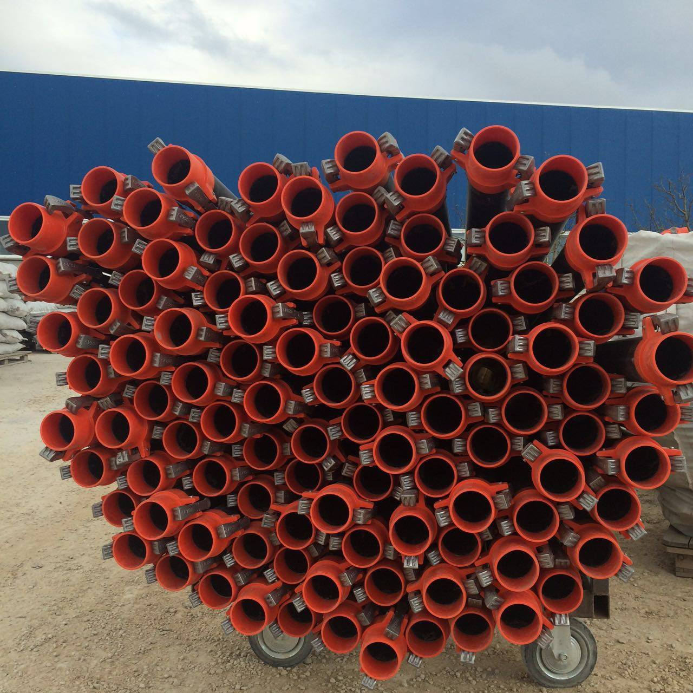
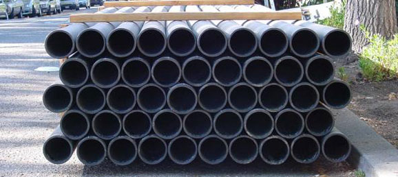
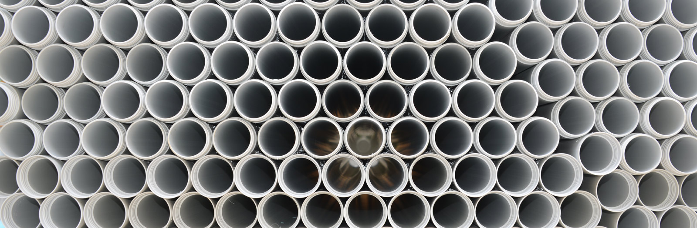
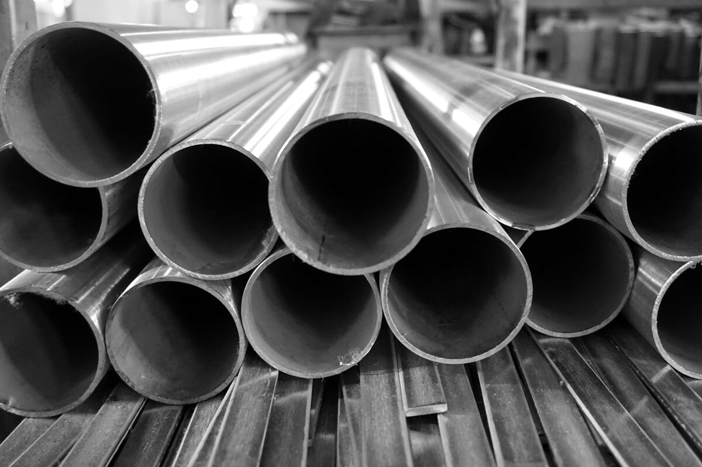

# Finolexpipes
This project was undertaken to automate some process of counting the number of pipes loaded on a truck by taking a image. The implementation uses opencv functions to detect the circles in the image.
The algorithm gives, as an output, number of pipes and the marks the pipes.
Future work would be focussed towards detecting multiple concentric pipes.

## Examples of input images

## Examples of output images

